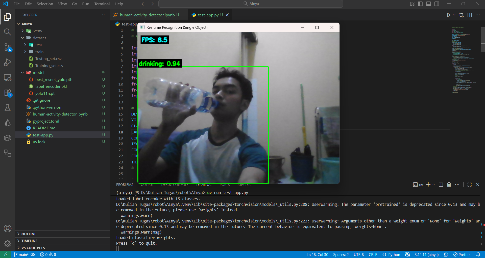

# Human Activity Recognition

## How to Use

1. Download the dataset [here](https://www.kaggle.com/datasets/meetnagadia/human-action-recognition-har-dataset/data)

2. and then set the path to be like this

```cmd
./
|
├─── dataset/
|    ├─── test/
|    ├─── train/
|    └─── ...
└───...
```

3. Change the `OUTPUT_DIR` variable in the ipynb file

```py
OUTPUT_DIR = "./model"
```

4. Download the dependencies

```shell
uv sync
```

5. Run the `.ipynb` file to get the model weight

6. Make sure you already have the models in `model` folder

```cmd
./
|
├─── model/
|    ├─── best_resnet_yolo.pth
|    ├─── label_encoder.pkl
|    └─── yolo12n.pt
└───...
```

7. Run the `test-app.py`

```shell
uv run test-app.py
```

8. The result should be looked like this

